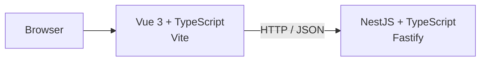

# Invoice Platform

## Commit 1 scope

This commit intentionally contains only workspace/bootstrap concerns:

- pnpm monorepo
- Vue frontend application
- NestJS backend application
- shared TypeScript configuration
- root development/build/lint/test commands
- initial engineering conventions

The invoice domain, persistence, Redis, SQS, OAuth, integrations, events, tests and AWS infrastructure belong to later commits.

